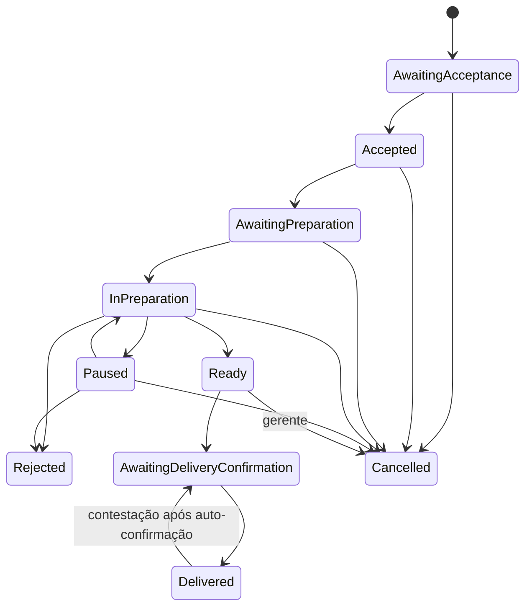

# Pedido e Produção

`Rejected` é consequência operacional; Ordering cancela comercialmente por evento idempotente. A seta
de `Delivered` só existe durante a janela configurada após auto-confirmação, nunca após confirmação manual.
