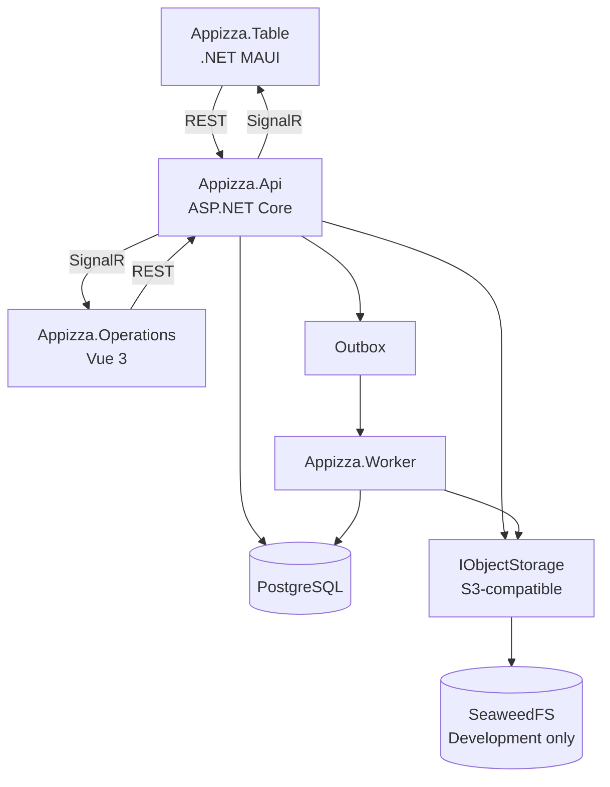

# Diagrama de Arquitetura

```mermaid
flowchart TD
  TABLE[Appizza.Table<br/>.NET MAUI] -->|REST| API[Appizza.Api<br/>ASP.NET Core]
  OPS[Appizza.Operations<br/>Vue 3] -->|REST| API
  API --> DB[(PostgreSQL)]
  API --> STORAGE[IObjectStorage<br/>S3-compatible]
  STORAGE --> OBJ[(SeaweedFS<br/>Development only)]
  API --> OUTBOX[Outbox]
  WORKER[Appizza.Worker] --> DB
  WORKER --> STORAGE
  API -->|SignalR| TABLE
  API -->|SignalR| OPS
  OUTBOX --> WORKER
```
