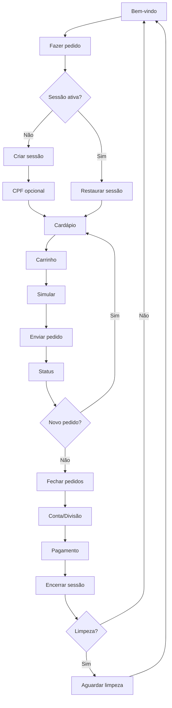

# Fluxo do Cliente

```mermaid
flowchart TD
  A[Bem-vindo] --> B[Fazer pedido]
  B --> C{Sessão ativa?}
  C -- Não --> D[Criar sessão]
  C -- Sim --> E[Restaurar sessão]
  D --> F[CPF opcional]
  F --> G[Cardápio]
  E --> G
  G --> H[Carrinho]
  H --> I[Simular]
  I --> J[Enviar pedido]
  J --> K[Status]
  K --> L{Novo pedido?}
  L -- Sim --> G
  L -- Não --> M[Fechar pedidos]
  M --> N[Conta/Divisão]
  N --> O[Pagamento]
  O --> P[Encerrar sessão]
  P --> Q{Limpeza?}
  Q -- Não --> A
  Q -- Sim --> R[Aguardar limpeza]
  R --> A
```
