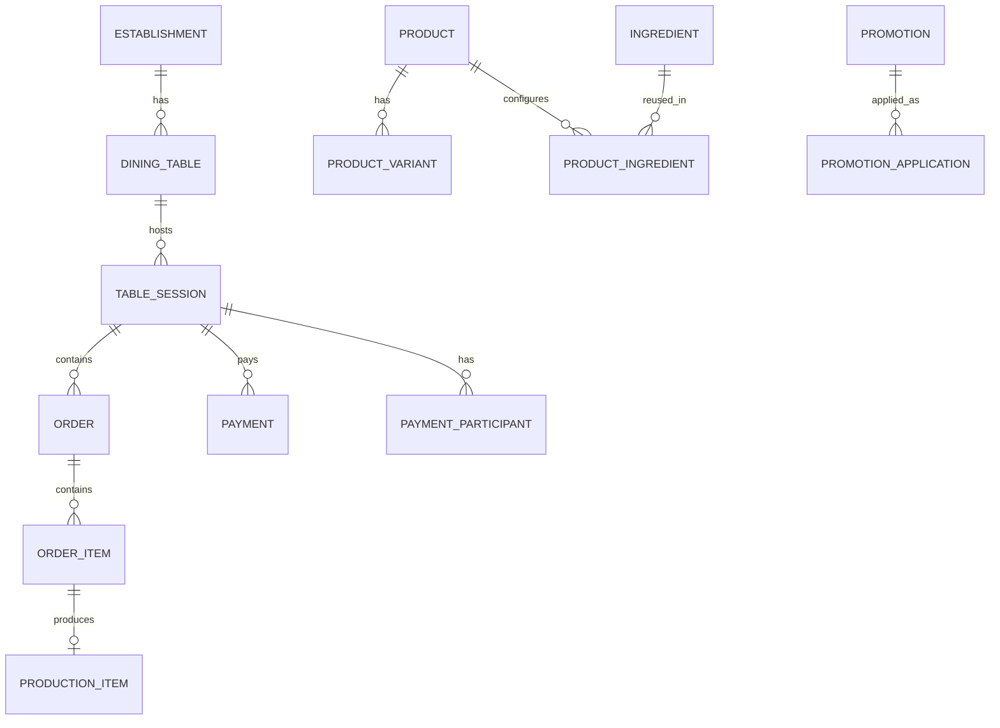

# Modelo de Dados — Visão Geral

```mermaid
erDiagram
  ESTABLISHMENT ||--o{ DINING_TABLE : has
  DINING_TABLE ||--o{ TABLE_SESSION : hosts
  TABLE_SESSION ||--o{ ORDER : contains
  ORDER ||--o{ ORDER_ITEM : contains
  ORDER_ITEM ||--o| PRODUCTION_ITEM : produces
  TABLE_SESSION ||--o{ PAYMENT : pays
  TABLE_SESSION ||--o{ PAYMENT_PARTICIPANT : has
  PRODUCT ||--o{ PRODUCT_VARIANT : has
  PRODUCT ||--o{ PRODUCT_INGREDIENT : configures
  INGREDIENT ||--o{ PRODUCT_INGREDIENT : reused_in
  PROMOTION ||--o{ PROMOTION_APPLICATION : applied_as
```
