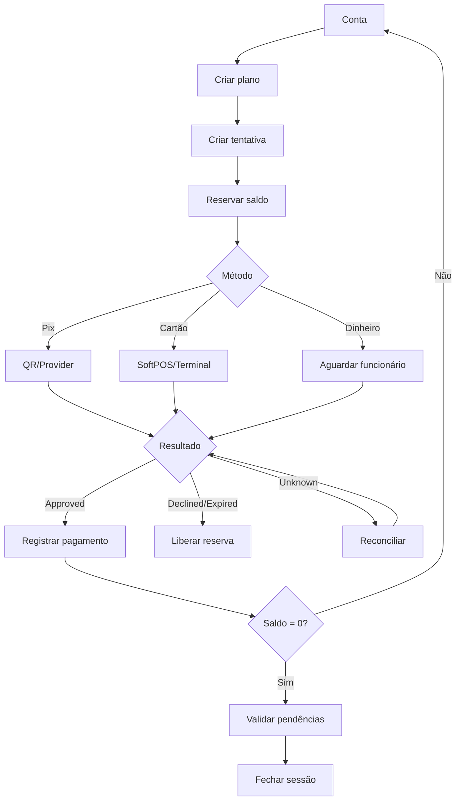

# Fluxo de Pagamento

```mermaid
flowchart TD
  A[Conta] --> B[Criar plano]
  B --> C[Criar tentativa]
  C --> D[Reservar saldo]
  D --> E{Método}
  E -->|Pix| F[QR/Provider]
  E -->|Cartão| G[SoftPOS/Terminal]
  E -->|Dinheiro| H[Aguardar funcionário]
  F --> I{Resultado}
  G --> I
  H --> I
  I -- Approved --> J[Registrar pagamento]
  I -- Declined/Expired --> K[Liberar reserva]
  I -- Unknown --> L[Reconciliar]
  L --> I
  J --> M{Saldo = 0?}
  M -- Não --> A
  M -- Sim --> N[Validar pendências]
  N --> O[Fechar sessão]
```
